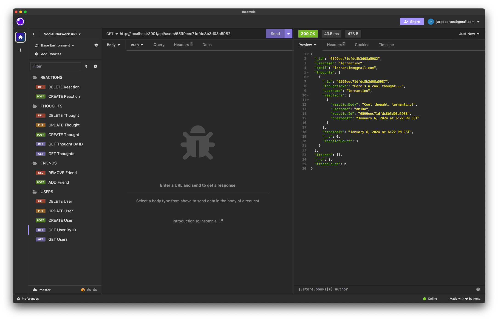
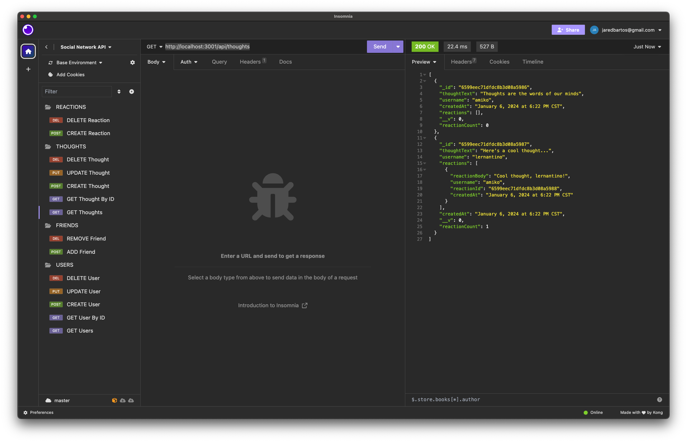
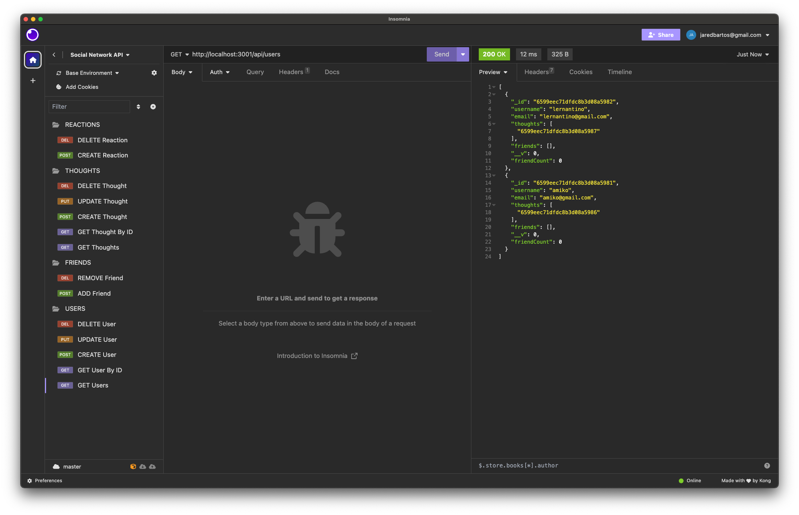
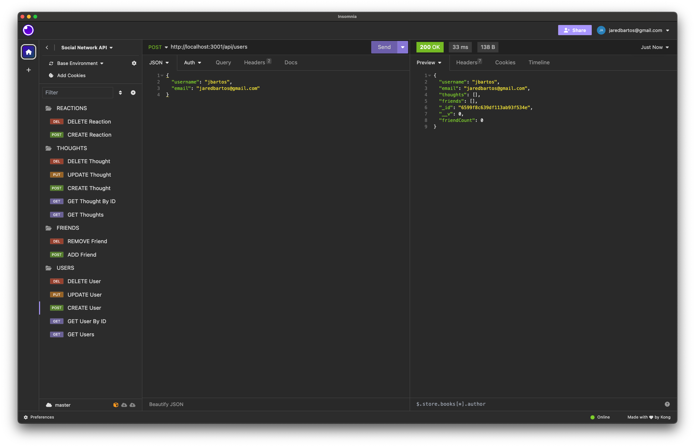

# Social Network API

## Description

This project is a back-end API for a social network web application where users can share thoughts, react to the thoughts of friends and create a friend list. This back-end functionality was built using Express.js, MongoDB, and Mongoose. It also utilizes the Luxon.js library to format the dates of created content.

## Table of Contents
- [Requirements](#requirements)
- [Installation](#installation)
- [Usage](#usage)
- [License](#license)
- [Questions](#questions)
- [Link to Demonstration Video](#link-to-demonstration-video)
- [Screenshots](#screenshots)

## Requirements

[Node.js](https://nodejs.org/en)

[MongoDB](https://www.mongodb.com/)

## Installation

To install the components of the project, clone the repo into a chosen directory. Navigate to the cloned repo and enter the following command:

`npm i`

This will install the modules needed to run the back end.

If you would like to seed the database with sample data, enter:

`npm run seed`

This will run a seed file that populates the database with stock entries. You can use these to test out the API.

## Usage

Use Postman, Insomnia or other API platform to test the API with ease. The individual routes able to be used are commented in the /routes/api folder of the repository. See the screenshots below for examples.

## License

This application is covered under MIT License.

Please refer to the LICENSE file in repo for more information.

## Questions

My GitHub profile: https://github.com/jaredbartos

If you have any further questions, please contact me through email.

jaredbartos@gmail.com

## Link to Demonstration Video

## Screenshots

